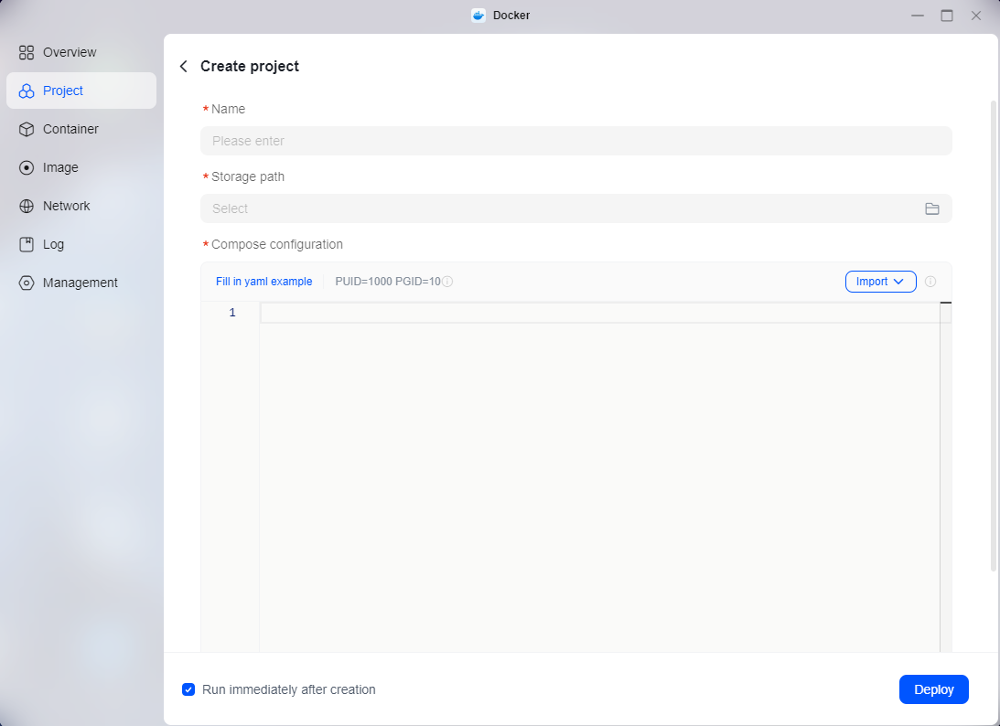
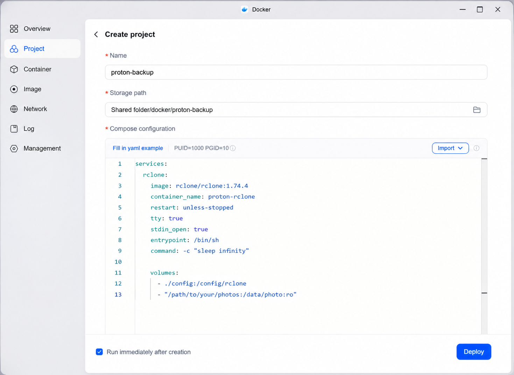
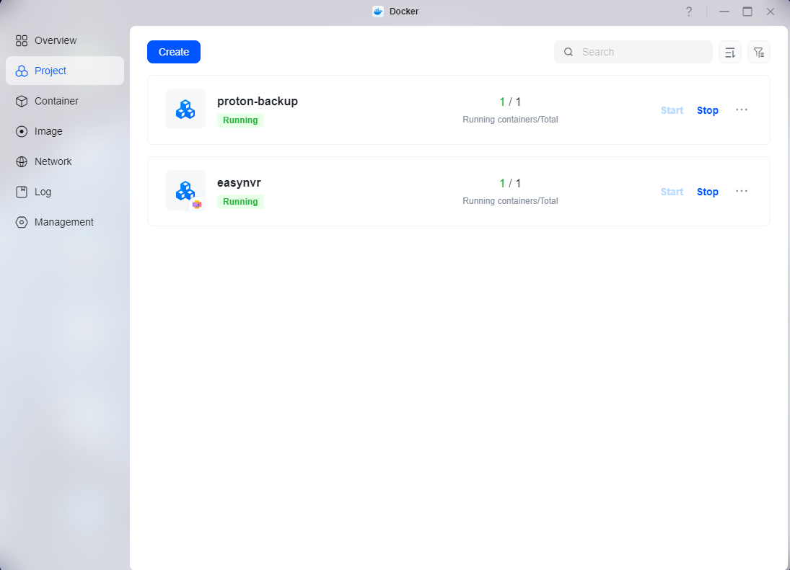
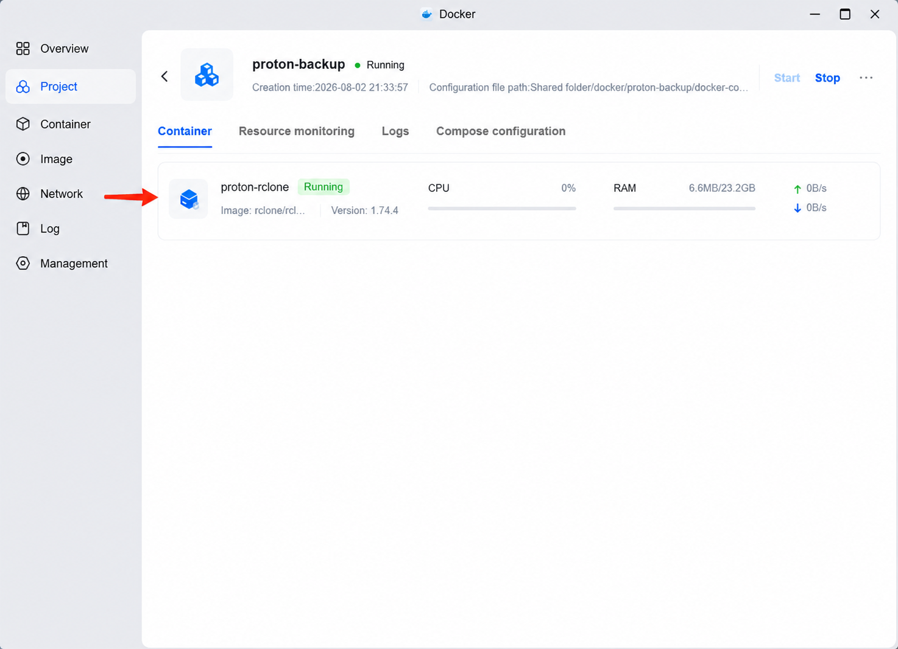
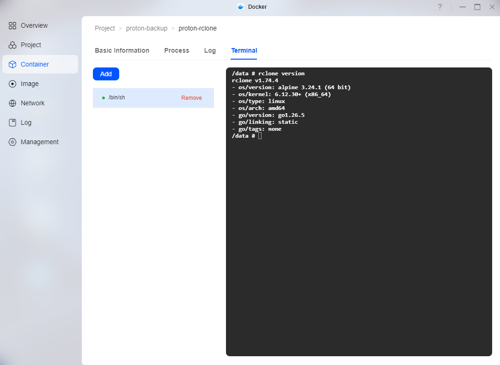
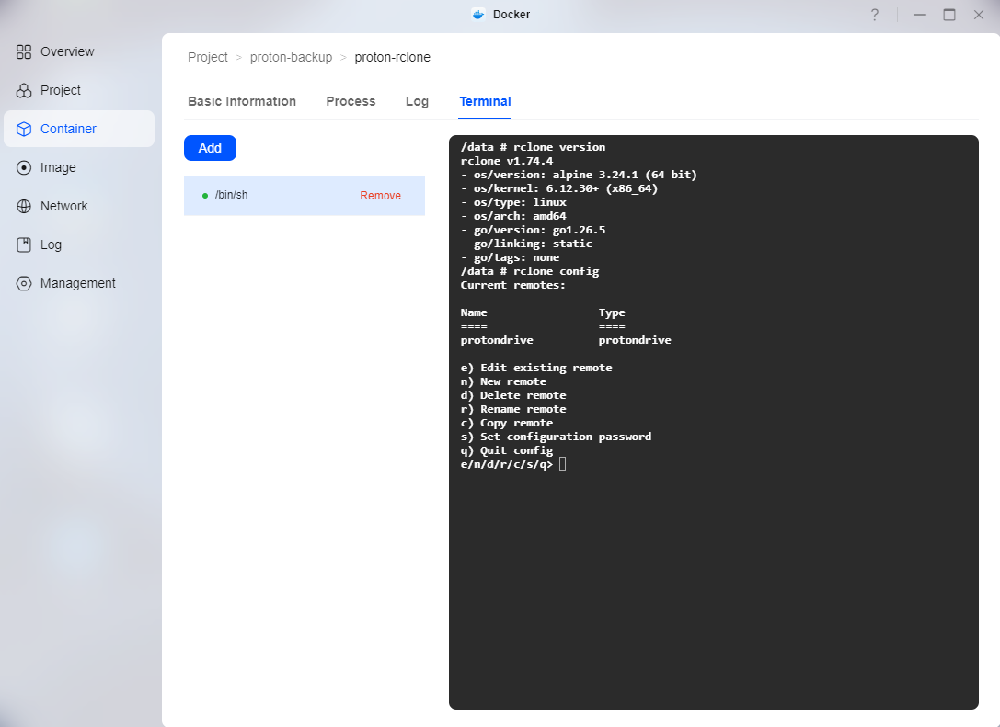
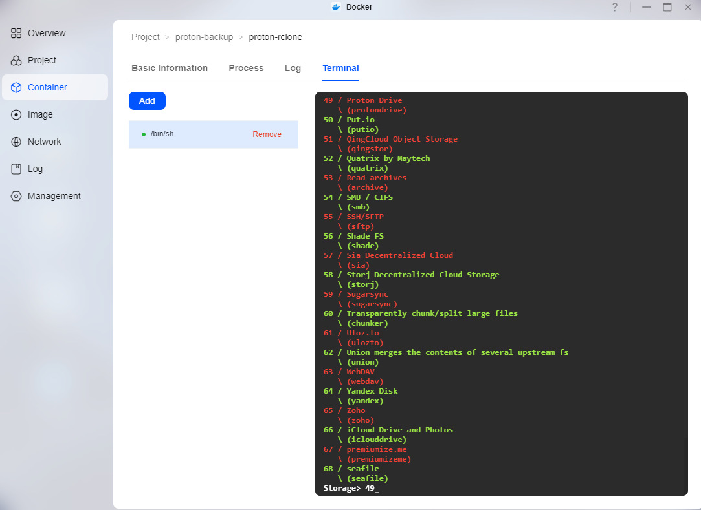
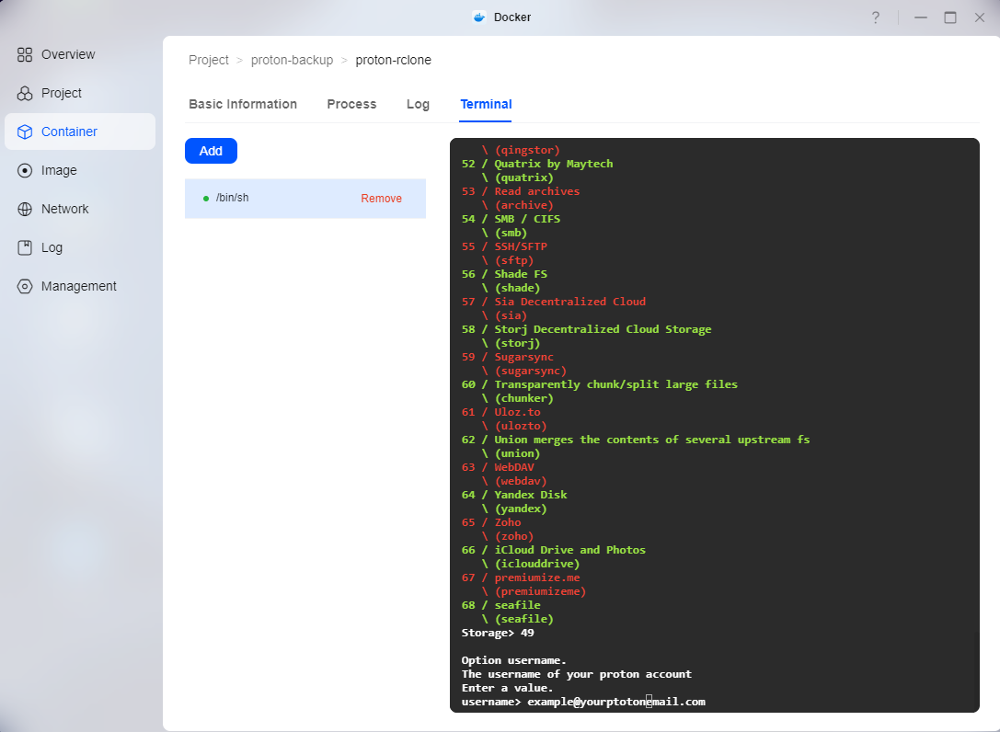

# UGREEN NAS → Proton Drive Setup Guide

This guide explains how to configure a UGREEN NAS running **UGOS Pro** to back up files to **Proton Drive** using Docker and rclone.

The instructions are based on a real working installation that successfully transferred approximately **322 GB across 24,399 files**.

> **Important**
>
> This setup was tested with **rclone 1.74.4**.
>
> Always test with a few files before starting a large backup.

---

## 1. Requirements

Before starting, you need:

* UGREEN NAS running UGOS Pro
* Docker / Docker Projects installed
* Proton Drive account
* Proton 2FA enabled
* Access to your Proton Base32 OTP Secret Key
* rclone 1.74.4
* A folder on the NAS that you want to back up

---

## 2. Create the Docker Project

Open **Docker** on your UGREEN NAS.

Go to:

**Projects → Create Project**


You will now see the Create Project screen:



Use:

```text
Project name: proton-backup
```

A typical project location is:

```text
Shared Folder/docker/proton-backup
```

The project will contain:

```text
proton-backup/
├── docker-compose.yml
└── config/
```

The `config` folder will contain the rclone configuration after setup.

---

## 3. Docker Compose

The repository contains the ready-to-use:

```text
docker-compose.yml
```

The important folder mapping looks like this:

```text
- "/path/to/your/photos:/data/photo:ro"
```

The path on the **left** is the real folder on your UGREEN NAS.

The path on the **right** is how rclone sees that folder inside the Docker container.

### Example

If your NAS folder is:

```text
/volume1/Photos
```

use:

```text
- "/volume1/Photos:/data/photo:ro"
```

Another real-world example could be:

```text
- "/volume1/Family Photo And Videoes/Family Photo:/data/photo:ro"
```

Inside the container, both examples are accessed as:

```text
/data/photo
```

The final:

```text
:ro
```

means **read-only**.

This allows the container to read the files but prevents it from modifying or deleting the originals on the NAS.

Enter the Compose configuration:



---

## 4. Start the Docker Project

Start the project in the UGREEN Docker interface.

The project should show that it is running:



The container should appear as:

```text
proton-rclone
```

Its status should show that it is running.



---

## 5. Open the Container Terminal

Open the `proton-rclone` container.

Open its terminal and use:

```text
/bin/sh
```

You should now have a command prompt inside the rclone container.

Test rclone:

```text
rclone version
```

The tested version for this guide should report:

```text
rclone v1.74.4
```



---

## 6. Configure Proton Drive

Run:

```text
rclone config
```



Choose:

```text
n
```

to create a new remote.

Enter a name.

This guide uses:

```text
protondrive
```

When rclone shows the available storage providers, select:

```text
Proton Drive
```


Select Proton Drive:



Enter your Proton account email and Proton account password when requested.



---

## 7. Proton Two-Factor Authentication

If your Proton account uses 2FA, rclone will ask for authentication information.

The following image shows example authentication values:


You will encounter three different values during this process:

### Proton account password

Your normal Proton login password.

### 6-digit authentication code

The temporary six-digit code generated by your authenticator app.

Example:

```text
123456
```

This changes regularly.

### OTP Secret Key

This is completely different from the six-digit code.

It is the long **Base32 secret** used by your authenticator to generate new codes automatically.

Example format:

```text
JBSWY3DPEHPK3PXPXXXXXXXXXXXXXXXX
```

> **Caution**
>
> The example above is fake.
>
> Never publish your real OTP Secret Key.

---

## 8. The Confusing `otp_secret_key` Prompt

During configuration rclone may display:

```text
Option otp_secret_key
```

Choose the option to enter your own value.

rclone may then display:

```text
Enter the password:
```

This prompt is confusing.

**It is NOT asking for your Proton account password at this point.**

Enter your **Base32 OTP Secret Key**.

When rclone asks:

```text
Confirm the password:
```

enter the same Base32 OTP Secret Key again.

---

## 9. Finish the Configuration

When asked about Advanced Config, choose:

```text
n
```

Keep the new remote when prompted.

Then quit the configuration menu:

```text
q
```

---

## 10. Check the Configuration

Run:

```text
rclone config show
```

You should see your Proton Drive remote.

Do not copy or publish the complete output because it may contain authentication information.

---

## 11. Remove an Expired `2fa` Value

During testing we encountered an issue where a temporary 2FA value remained in `rclone.conf`.

Because the six-digit 2FA code expires, this can later prevent authentication even though the OTP Secret Key is configured correctly.

Remove the temporary `2fa =` line with:

```text
sed -i '/^2fa =/d' /config/rclone/rclone.conf
```

Then check again:

```text
rclone config show
```

The configuration should contain the OTP-secret configuration but should **not** contain an old:

```text
2fa =
```

entry.

---

## 12. Test the Proton Drive Connection

Before uploading anything, test the connection:

```text
rclone lsd protondrive:
```

If authentication works, rclone should list the folders in your Proton Drive.

Do not start a large backup until this command works correctly.

---

## 13. Test With One File First

This step is strongly recommended.

Find one image inside the mapped NAS folder.

For example:

```text
/data/photo/2007/example.jpg
```

Upload only that file:

```text
rclone copy "/data/photo/2007/example.jpg" protondrive:"Test74"
```

Then open Proton Drive.

Confirm that:

* The file exists
* The file can be opened
* The file can be downloaded
* The downloaded file is not corrupted

Only continue when this test succeeds.

---

## 14. Full Backup

After the test file has been verified, start the full backup.

Example:

```text
rclone copy "/data/photo" protondrive:"Family Photo And Videoes/Family Photo" \
  --progress \
  --transfers=1 \
  --checkers=2 \
  --create-empty-src-dirs \
  --retries=20 \
  --low-level-retries=50 \
  --retries-sleep=30s \
  --protondrive-replace-existing-draft=true \
  --log-file=/config/photo-backup.log \
  --log-level=INFO
```

Change the Proton Drive destination:

```text
Family Photo And Videoes/Family Photo
```

to whatever destination you want to use.

---

## 15. Why These Settings?

### `--transfers=1`

Uploads one file at a time.

This was chosen for reliability during the tested Proton Drive backup.

### `--checkers=2`

Uses two checkers when comparing files.

### `--create-empty-src-dirs`

Creates empty source folders at the destination.

### `--retries=20`

Retries failed operations instead of stopping immediately.

### `--low-level-retries=50`

Allows additional retries for lower-level connection/API failures.

### `--retries-sleep=30s`

Waits before retrying.

This is useful if Proton temporarily rejects a request.

### `--protondrive-replace-existing-draft=true`

Helps deal with incomplete/draft uploads already present in Proton Drive.

### Logging

The log is stored at:

```text
/config/photo-backup.log
```

This is useful when troubleshooting failed transfers.

---

## 16. Power or Internet Failure

A large backup can take many hours or even days.

If the NAS loses power or the internet connection disappears, you do **not** need to start everything from scratch.

Run the same `rclone copy` command again.

rclone will compare the source and destination and continue with files that still need to be transferred.

---

## 17. Why We Use `copy` Instead of `sync`

This guide deliberately uses:

```text
rclone copy
```

instead of:

```text
rclone sync
```

For important photo and video archives this is safer.

If a file is accidentally removed from the NAS, `copy` does not automatically mean that the Proton Drive backup must also be deleted.

This gives the cloud copy an additional layer of protection.

---

## 18. Photos and Videos

For very large collections, it can be useful to back up photos and videos separately.

Example Docker mappings:

### Photos

```text
- "/volume1/Photos:/data/photo:ro"
```

### Videos

```text
- "/volume1/Videos:/data/video:ro"
```

The video backup could then use:

```text
rclone copy "/data/video" protondrive:"Family Videos" --progress
```

Test the photo backup completely before adding additional backup jobs.

---

## 19. Tested Result

The setup documented here has been used for a real-world transfer of approximately:

```text
322 GB
24,399 files
```

from a UGREEN NAS to Proton Drive.

This was not only a small test installation.

---

## Next

Continue with:

* [Proton 2FA details](proton-2fa.md)
* [Troubleshooting](troubleshooting.md)
