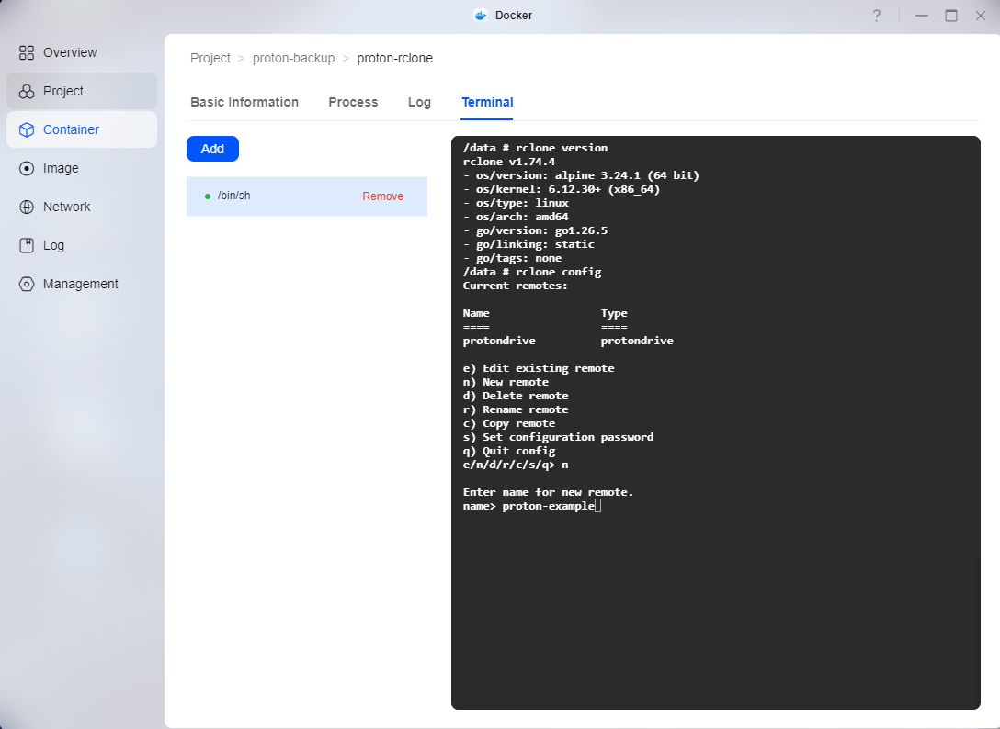
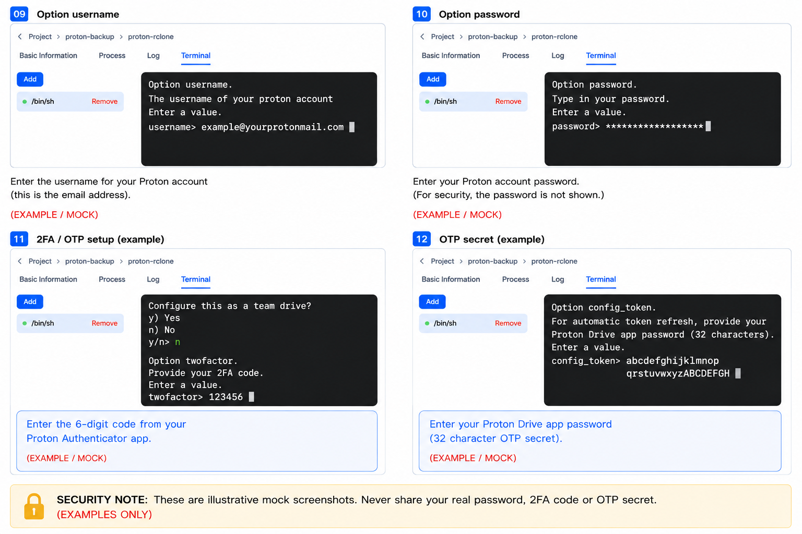
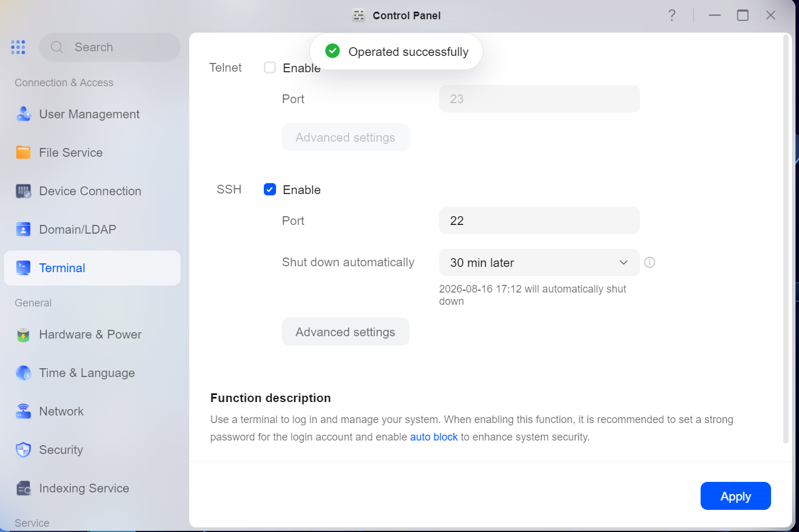
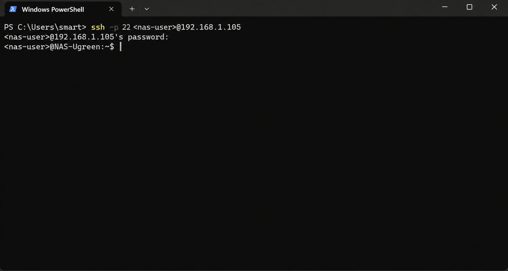
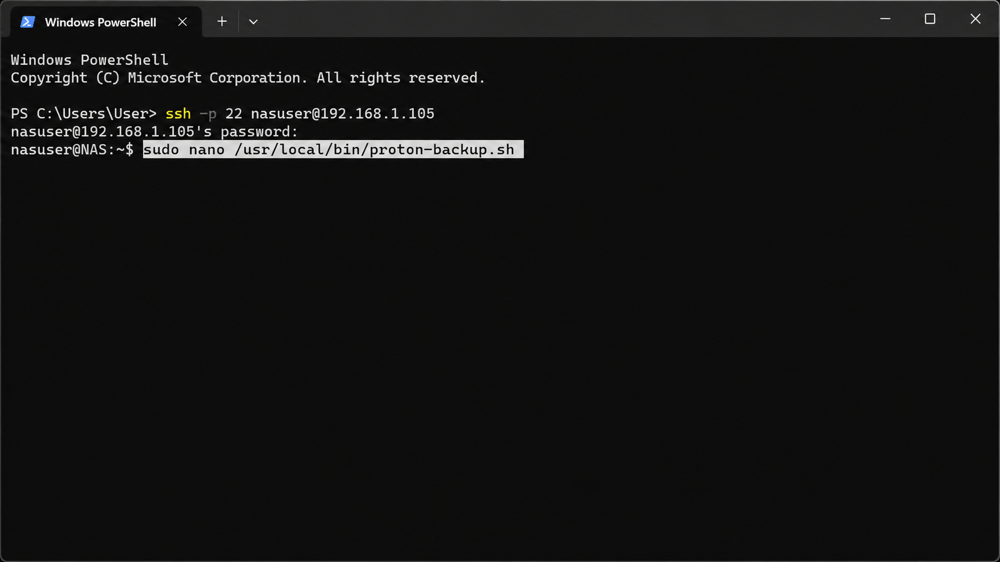
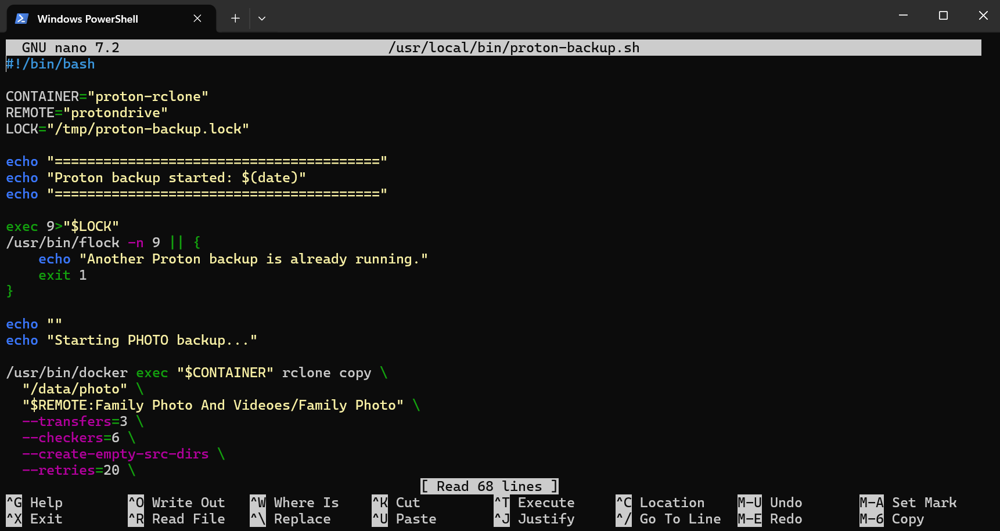
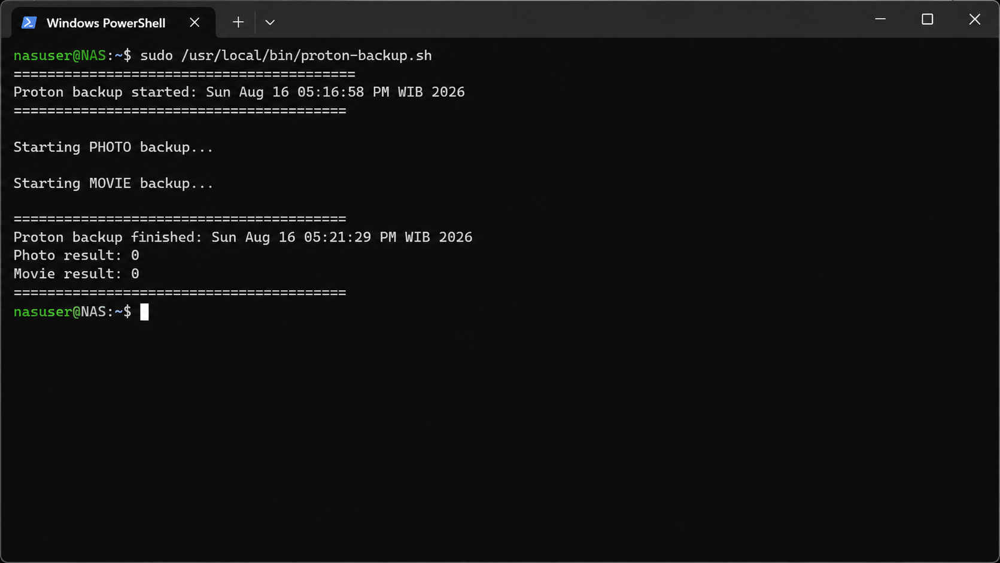
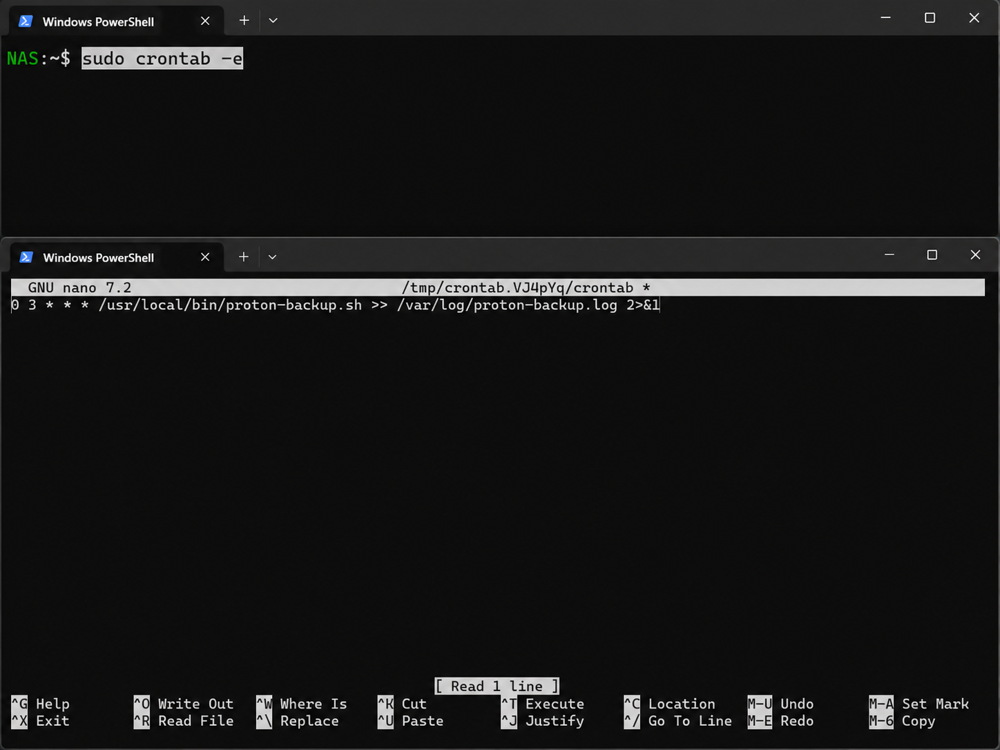
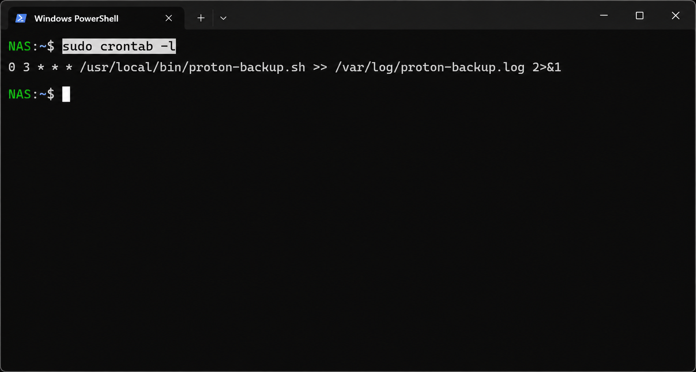
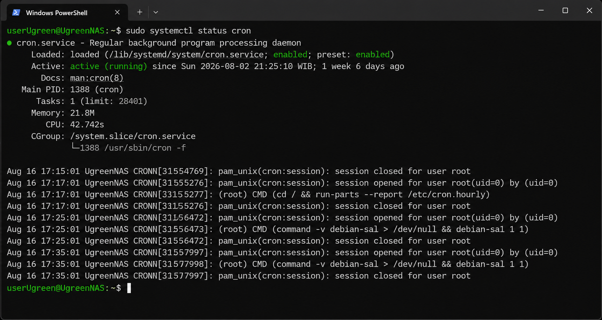

# UGREEN NAS → Proton Drive Setup Guide

A complete step-by-step guide for backing up files from a **UGREEN NAS running UGOS Pro** to **Proton Drive** using **Docker + rclone**.

This guide is based on a real working setup and includes both the initial Proton Drive configuration and a fully automatic nightly backup.

---

# Before You Start

## Requirements

You need:

* A UGREEN NAS running UGOS Pro
* Docker installed on the NAS
* A Proton Drive account
* Proton two-factor authentication enabled
* Access to your Proton OTP secret key
* Basic access to the UGREEN Docker interface
* A Windows, macOS or Linux computer for the initial setup

This guide uses:

```text
rclone 1.74.4
```

This version was tested successfully with Proton Drive.

> **Important:** Proton Drive support in rclone can change between versions. Test your setup with a single file before starting a large backup.

---

# Part 1 — Create the Docker Project

## 1. Open Docker → Project

Open the **Docker** application on your UGREEN NAS.

Go to:

```text
Docker → Project
```

This page shows the Docker projects currently configured on the NAS.


Click:

```text
Create
```

to create a new Docker project.

---

## 2. Create the Proton Backup Project

The **Create project** screen will open.


Use:

```text
Name:
proton-backup
```

Choose a storage location for the project.

Example:

```text
Shared Folder/docker/proton-backup
```

This directory will contain the Docker project and the persistent rclone configuration.

---

## 3. Add the Docker Compose Configuration

In the **Compose configuration** field, add the Docker Compose configuration.


Example:

```yaml
services:
  rclone:
    image: rclone/rclone:1.74.4
    container_name: proton-rclone
    restart: unless-stopped
    tty: true
    stdin_open: true
    entrypoint: /bin/sh
    command: -c "sleep infinity"

    volumes:
      - ./config:/config/rclone
      - "/path/to/your/photos:/data/photo:ro"
      - "/path/to/your/movies:/data/movie:ro"
```

Replace:

```text
/path/to/your/photos
```

and:

```text
/path/to/your/movies
```

with the real folders on your NAS.

For example:

```yaml
- "/volume1/Family Photo And Videoes/Family Photo:/data/photo:ro"
- "/volume1/Family Photo And Videoes/Family Movies:/data/movie:ro"
```

The `:ro` option means **read only**.

This prevents the Docker container from modifying or deleting your original files on the NAS.

Click:

```text
Deploy
```

---

## 4. Verify That proton-backup Is Running

After deployment, the new project should appear as:

```text
proton-backup
```

with status:

```text
Running
```


Open the project.

---

## 5. Open the proton-rclone Container

Inside the project you should see:

```text
proton-rclone
```


Make sure the container is running.

Open:

```text
Terminal
```

and start:

```text
/bin/sh
```

You should now have a terminal inside the rclone container.

---

# Part 2 — Configure rclone

## 6. Check the rclone Version

In the container terminal run:

```bash
rclone version
```

You should see:

```text
rclone v1.74.4
```


This guide was tested with **rclone 1.74.4**.

---

## 7. Start rclone Configuration

Run:

```bash
rclone config
```


Choose:

```text
n
```

for:

```text
New remote
```

Give the remote a name.

This guide uses:

```text
protondrive
```

The exact spelling matters because we will use this name in all later commands.

---

## 8. Select Proton Drive

When rclone displays the list of supported storage providers, select:

```text
Proton Drive
```



The number shown next to Proton Drive can change between rclone versions.

Therefore, select **Proton Drive by name** rather than relying only on the number shown in this guide.

---

## 9. Proton Drive Configuration

Continue through the Proton Drive configuration.


rclone will ask for your Proton account information.

In the storage list, Proton Drive is shown as:


```text
49 / Proton Drive
   \ (protondrive)

Enter:

49

and press Enter.

Note: The storage number may be different in another rclone version. This guide uses rclone 1.74.4, where Proton Drive is shown as 49. If your number is different, select the entry named Proton Drive (protondrive).

rclone will then continue with the Proton Drive configuration and ask for your Proton account information.


---


```
## 10. Enter Your Proton Username

When rclone displays:

```text
Option username
The username of your Proton account.
enter your Proton account email address.

Example:

```text
yourname@proton.me
```


---

## 11. Proton Password, 2FA and OTP Secret

Proton authentication is the most important part of the configuration.



There are **three different values** involved.

### Proton account password

When rclone displays:

```text
Option password
The password of your Proton account.
```

choose:

```text
y
```

and enter your normal Proton account password.

---

### Current 6-digit 2FA code

rclone may ask for the current authentication code.

Enter the current **6-digit code** from your authenticator.

Example:

```text
123456
```

This code changes regularly.

---

### OTP Secret Key

Later rclone displays:

```text
Option otp_secret_key
```

Choose:

```text
y
```

rclone will then display:

```text
Enter the password:
```

> **IMPORTANT:** At this point it is NOT asking for your normal Proton password.

It is asking for the **Base32 OTP Secret Key** associated with Proton 2FA.

Enter the long Base32 secret.

When it asks:

```text
Confirm the password:
```

enter the same OTP secret again.

### Do not confuse these three values

| Value                       | Used for                               |
| --------------------------- | -------------------------------------- |
| Proton account password     | Proton login                           |
| 6-digit authentication code | Temporary 2FA authentication           |
| Base32 OTP Secret Key       | Automatic rclone Proton authentication |


---

## 12. Finish the rclone Configuration

When asked about advanced configuration, normally choose:

```text
n
```

When rclone asks whether you want to keep the remote, choose:

```text
y
```

Then quit the configuration menu:

```text
q
```

Your remote should now be named:

```text
protondrive
```

---

## 13. Remove an Expired Temporary 2FA Value

If the generated configuration contains a temporary:

```text
2fa =
```

entry, remove it so rclone does not try to reuse an expired 6-digit code.

Inside the container run:

```bash
sed -i '/^2fa =/d' /config/rclone/rclone.conf
```

Then verify the configuration:

```bash
rclone config show
```

You should have your Proton remote and OTP secret configuration, but no expired temporary `2fa =` value.

> Never publish the output of `rclone config show` without removing passwords, tokens and OTP secrets first.

---

# Part 4 — Test Proton Drive

## 14. Test the Proton Drive Connection

Run:

```bash
rclone lsd protondrive:
```

If the configuration is working, rclone should display the folders in your Proton Drive.

If this fails, do not start a full backup yet.

Fix the authentication or connection first.

---

## 15. Upload One Test File

Before transferring hundreds of gigabytes, upload **one single image**.

Example:

```bash
rclone copy "/data/photo/2007/example.jpg" protondrive:"Test74"
```

Then open Proton Drive in your browser.

Verify that:

* The file exists
* The file opens correctly
* The file can be downloaded
* The downloaded file is not corrupted

This test is extremely important.

---

## 16. Start the Full Photo Backup

After the single-file test succeeds, start the photo backup.

Example:

```bash
rclone copy "/data/photo" \
  protondrive:"Family Photo And Videoes/Family Photo" \
  --progress \
  --transfers=1 \
  --checkers=2 \
  --create-empty-src-dirs \
  --retries=20 \
  --low-level-retries=50 \
  --retries-sleep=30s \
  --protondrive-replace-existing-draft=true \
  --log-file=/config/photo-backup.log \
  --log-level=INFO
```

For a first large backup, conservative transfer settings can be useful.

Once the connection has proven stable, the values can be increased.

---

## 17. Why We Use `copy` Instead of `sync`

This guide deliberately uses:

```bash
rclone copy
```

instead of:

```bash
rclone sync
```

For important photo and video archives this is safer.

If a file is accidentally removed from the NAS, `copy` does not automatically mean that the Proton Drive backup must also be deleted.

This gives the cloud copy an additional layer of protection.

---

## 18. Photos and Videos

For very large collections, it can be useful to back up photos and videos separately.

Example Docker mappings:

### Photos

```yaml
- "/volume1/Photos:/data/photo:ro"
```

### Videos

```yaml
- "/volume1/Videos:/data/movie:ro"
```

The video backup can then use:

```bash
rclone copy "/data/movie" protondrive:"Family Videos" --progress
```

Test the photo backup completely before adding additional backup jobs.

---

## 19. Tested Result

The setup documented here has been used for a real-world transfer of approximately:

```text
322 GB
24,399 files
```

from a UGREEN NAS to Proton Drive.

This was not only a small test installation.

---

# Part 5 — Automatic Proton Drive Backup

Once the manual Proton Drive backup works correctly, the UGREEN NAS can perform the backup automatically.

The example below runs the backup every day at:

```text
03:00
```

The backup runs directly on the NAS.

**Your PC does not need to be turned on.**

---

## 20. Enable SSH on the UGREEN NAS

On the UGREEN NAS open:

```text
Control Panel → Terminal → SSH
```

Enable:

```text
SSH
```

Use port:

```text
22
```



For additional security, UGREEN can automatically disable SSH after a specified period.

For example:

```text
30 minutes
```

SSH is only needed while configuring or maintaining the automatic backup.

---

## 21. Connect to the NAS From PowerShell

On a Windows computer open **PowerShell**.

Connect to the UGREEN NAS:

```powershell
ssh -p 22 <nas-user>@<NAS-IP>
```

Example:

```powershell
ssh -p 22 userUgreen@192.168.1.105
```

Replace the example username and IP address with your own.

Enter your UGREEN NAS account password when requested.

Nothing appears on screen while entering the password.

That is normal.



After login you will have a shell directly on the UGREEN NAS.

---

## 22. Create the Automatic Backup Script

Create the backup script:

```bash
sudo nano /usr/local/bin/proton-backup.sh
```



The script will run the existing `rclone` installation inside the Docker container.

---

## 23. Add the Backup Script

Paste:

```bash
#!/bin/bash

CONTAINER="proton-rclone"
REMOTE="protondrive"
LOCK="/tmp/proton-backup.lock"

echo "========================================"
echo "Proton backup started: $(date)"
echo "========================================"

exec 9>"$LOCK"
/usr/bin/flock -n 9 || {
    echo "Another Proton backup is already running."
    exit 1
}

echo ""
echo "Starting PHOTO backup..."

/usr/bin/docker exec "$CONTAINER" rclone copy \
  "/data/photo" \
  "$REMOTE:Family Photo And Videoes/Family Photo" \
  --transfers=3 \
  --checkers=6 \
  --create-empty-src-dirs \
  --retries=20 \
  --low-level-retries=50 \
  --retries-sleep=30s \
  --contimeout=1m \
  --timeout=5m \
  --protondrive-replace-existing-draft=true \
  --log-file=/config/photo-backup.log \
  --log-level=INFO

PHOTO_RESULT=$?

echo ""
echo "Starting MOVIE backup..."

/usr/bin/docker exec "$CONTAINER" rclone copy \
  "/data/movie" \
  "$REMOTE:Family Photo And Videoes/Family Movies" \
  --transfers=3 \
  --checkers=6 \
  --create-empty-src-dirs \
  --retries=20 \
  --low-level-retries=50 \
  --retries-sleep=30s \
  --contimeout=1m \
  --timeout=5m \
  --protondrive-replace-existing-draft=true \
  --log-file=/config/movie-backup.log \
  --log-level=INFO

MOVIE_RESULT=$?

echo ""
echo "========================================"
echo "Proton backup finished: $(date)"
echo "Photo result: $PHOTO_RESULT"
echo "Movie result: $MOVIE_RESULT"
echo "========================================"

if [ "$PHOTO_RESULT" -ne 0 ] || [ "$MOVIE_RESULT" -ne 0 ]; then
    exit 1
fi

exit 0
```



### What the script does

It:

1. Uses the existing `proton-rclone` Docker container
2. Uses the existing `protondrive` remote
3. Prevents two backup jobs from running simultaneously
4. Copies the photo archive
5. Copies the movie archive
6. Writes separate rclone log files
7. Reports whether each backup completed successfully

The script uses:

```bash
rclone copy
```

not:

```bash
rclone sync
```

so deletions on the NAS are not automatically mirrored as deletions in Proton Drive.

### Save the script

In Nano press:

```text
CTRL+O
Enter
CTRL+X
```

Then make the script executable:

```bash
sudo chmod +x /usr/local/bin/proton-backup.sh
```

---

## 24. Test the Automatic Backup Script

Before scheduling the backup, run the script manually:

```bash
sudo /usr/local/bin/proton-backup.sh
```



A successful run should end with:

```text
Proton backup finished: ...
Photo result: 0
Movie result: 0
```

Both:

```text
0
```

results indicate success.

If either result is not `0`, fix the problem before creating the automatic schedule.

---

# Part 6 — Schedule the Backup

## 25. Create the Cron Schedule

Open the root crontab:

```bash
sudo crontab -e
```

Add:

```cron
0 3 * * * /usr/local/bin/proton-backup.sh >> /var/log/proton-backup.log 2>&1
```



This means:

```text
0      Minute
3      Hour
*      Every day of the month
*      Every month
*      Every day of the week
```

Therefore the backup starts:

```text
Every day at 03:00
```

> Cron uses the NAS system time. Make sure the UGREEN NAS time and timezone are correct.

Save with:

```text
CTRL+O
Enter
CTRL+X
```

---

## 26. Verify the Cron Job

Run:

```bash
sudo crontab -l
```

You should see:

```cron
0 3 * * * /usr/local/bin/proton-backup.sh >> /var/log/proton-backup.log 2>&1
```



This confirms that the scheduled job has been saved.

---

## 27. Verify That the Cron Service Is Running

Check the cron service:

```bash
sudo systemctl status cron
```



You should see something similar to:

```text
Loaded: loaded (...; enabled; ...)
Active: active (running)
```

The important values are:

```text
enabled
active (running)
```

If both are present, the cron service is running and enabled to start automatically with the NAS.

---

# Part 7 — Check the Automatic Backup

## 28. Check the Main Automatic Backup Log

After the scheduled backup has run, connect to the NAS with SSH and check:

```bash
sudo tail -n 100 /var/log/proton-backup.log
```

A successful run should contain something similar to:

```text
========================================
Proton backup started: ...
========================================

Starting PHOTO backup...

Starting MOVIE backup...

========================================
Proton backup finished: ...
Photo result: 0
Movie result: 0
========================================
```

---

## 29. Check the Individual rclone Logs

The photo backup log is stored inside the persistent rclone configuration:

```text
/config/photo-backup.log
```

The movie backup log is:

```text
/config/movie-backup.log
```

These logs are useful when the main script reports a non-zero result.

---

## 30. Verify New Files in Proton Drive

The most important test is the real-world test.

After the automatic backup has run:

1. Open Proton Drive.
2. Find a file or folder that was added to the NAS after the previous backup.
3. Verify that it now exists in Proton Drive.
4. Open or download the file.
5. Confirm that it is usable.

Only after this test should the automatic backup be considered fully verified.

---

# Part 8 — Disable SSH Again

## 31. Disable SSH After Setup

The automatic backup does **not** require an SSH connection from your PC.

SSH is only used for configuration and maintenance.

Once everything is working, go back to:

```text
Control Panel → Terminal → SSH
```

and disable SSH.

The following will continue running:

```text
Docker
proton-rclone
cron
proton-backup.sh
```

Your PC can be completely turned off.

The UGREEN NAS performs the backup itself.

---

# Power or Network Failure

If the NAS loses power or internet access during an upload, do not start the entire backup from scratch.

The next:

```bash
rclone copy
```

run compares the source and destination and continues with files that still need to be copied.

Already transferred matching files are skipped.

The automatic nightly backup therefore provides another opportunity to complete interrupted transfers.

---

# Important Safety Notes

## Do Not Publish Credentials

Never upload screenshots or configuration files containing:

* Proton passwords
* Proton usernames if you want them private
* OTP secret keys
* 6-digit authentication codes
* rclone encrypted credentials
* API tokens
* SSH passwords

The screenshots in this repository use example or anonymized values.

---

## Back Up rclone.conf

After everything is working, keep a secure backup of:

```text
rclone.conf
```

The configuration contains the information required for the Proton Drive remote.

Treat it as sensitive information.

Do **not** upload your real `rclone.conf` to GitHub.

---

## Do Not Use `sync` Unless You Understand the Consequences

This guide intentionally uses:

```bash
rclone copy
```

A command such as:

```bash
rclone sync
```

has different deletion behavior.

For an important family photo/video archive, accidental NAS deletions should not automatically propagate to the cloud backup.

---

# Recommended Backup Workflow

A sensible workflow is:

```text
NAS
 ↓
Local family archive
 ↓
rclone copy
 ↓
Proton Drive
```

The NAS remains the primary source.

Proton Drive acts as an off-site copy.

For irreplaceable data, Proton Drive should not be the **only** additional copy.

A proper backup strategy can also include another local disk or another independent backup location.

---

# Troubleshooting

## Proton Drive Authentication Fails

Check:

```text
Proton username
Proton account password
OTP secret key
```

Make sure a temporary expired:

```text
2fa =
```

entry has not been left in the rclone configuration.

---

## rclone Can See Proton Drive but Uploads Fail

Test one small file:

```bash
rclone copy "/data/photo/example.jpg" protondrive:"Test"
```

Then verify that it opens correctly in Proton Drive.

---

## Automatic Backup Does Not Run

Check the scheduled job:

```bash
sudo crontab -l
```

Then check cron:

```bash
sudo systemctl status cron
```

Then check the backup log:

```bash
sudo tail -n 100 /var/log/proton-backup.log
```

---

## Backup Reports Another Job Is Running

The script deliberately prevents overlapping backup jobs.

If you see:

```text
Another Proton backup is already running.
```

first check whether a backup is genuinely still running.

Do not remove the locking mechanism unless you understand why the previous job did not finish.

---

# Complete

You now have:

```text
UGREEN NAS
     │
     ├── Docker
     │     │
     │     └── proton-rclone
     │            │
     │            └── rclone
     │                   │
     │                   └── Proton Drive
     │
     └── cron
           │
           └── /usr/local/bin/proton-backup.sh
                    │
                    ├── Family Photo
                    │
                    └── Family Movies
```

The backup runs automatically at:

```text
03:00 every day
```

and does not require your Windows PC to be running.

---

## Next

Continue with:

* [Proton 2FA details](proton-2fa.md)
* [Troubleshooting](troubleshooting.md)

---

[← Back to main README](../README.md)

